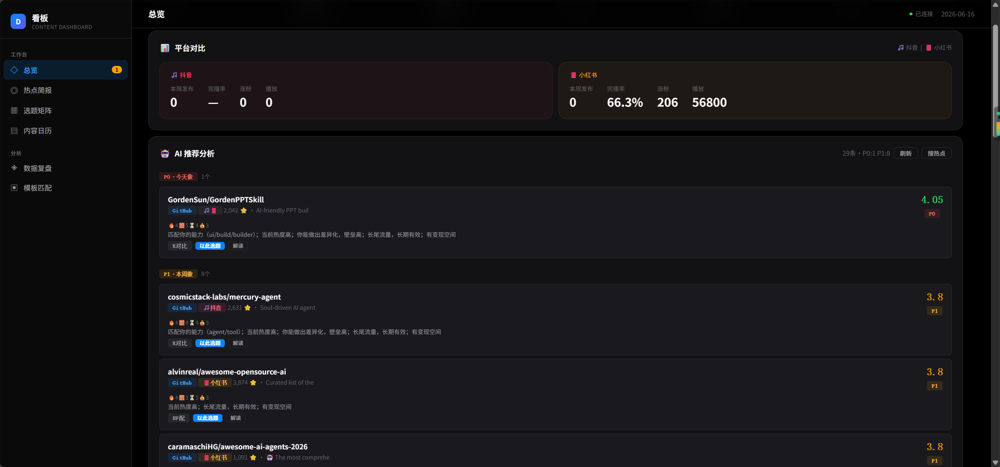
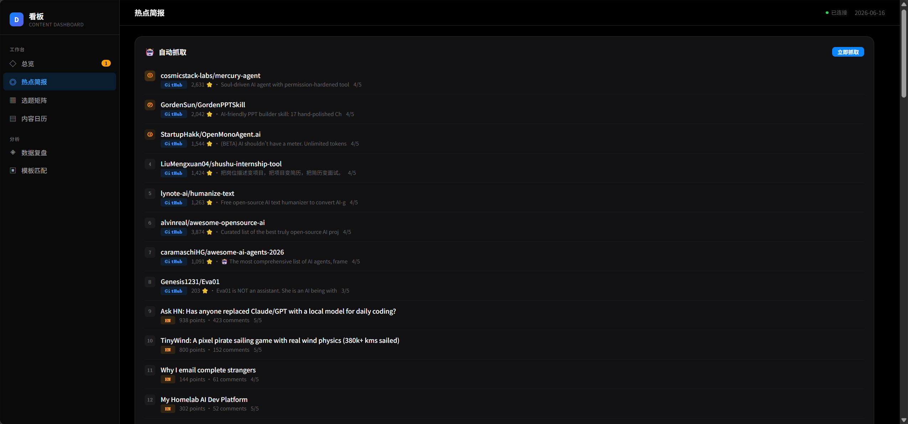
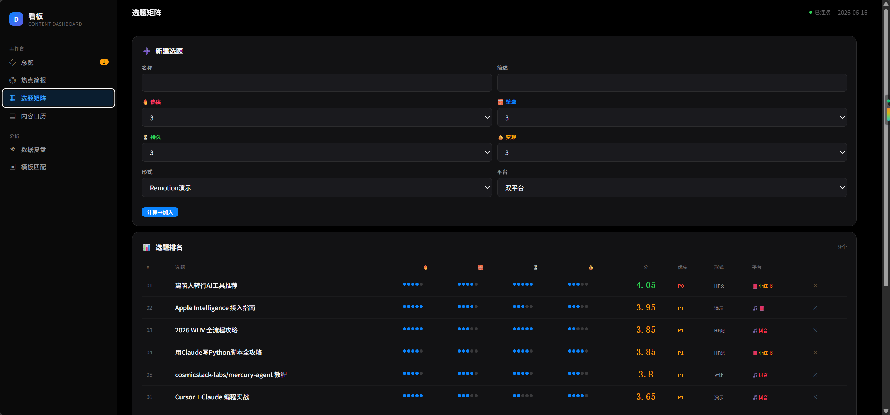
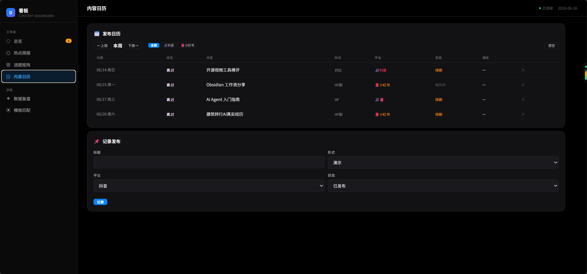
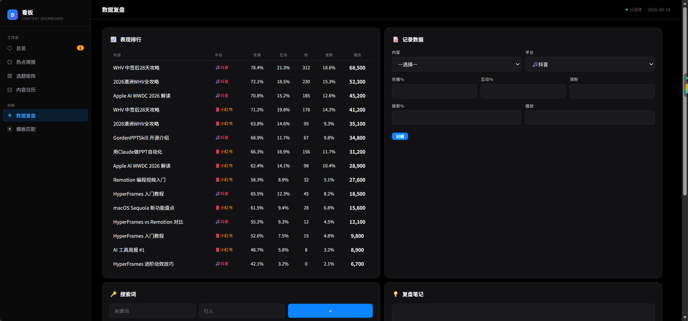
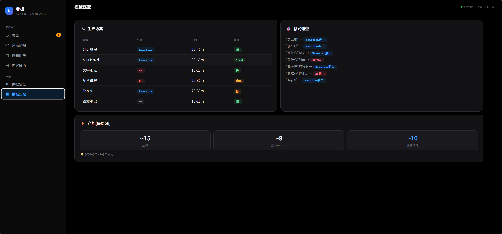

# Industrial-Grade AI Short Video Pipeline

> 工业级竖屏短视频 SaaS 生产流水线 | AI 决策 → SOP 执行 → 人工审美

[]()
[]()

---

## 系统架构

```
┌─────────────────────────────────────┐
│        AI 决策层（看板）              │
│  热点抓取 → 选题评分 → 自动建项目     │
├─────────────────────────────────────┤
│        SOP 执行层（HyperFrames）      │
│  剧本生成 → 渲染 → 封面注入 → 归档    │
├─────────────────────────────────────┤
│        人工审美层（审查）              │
│  文案确认 → 动画审查 → 封面定稿       │
└─────────────────────────────────────┘
```

---

## 核心卖点

| 能力 | 本流水线 | 竞品 |
|------|---------|------|
| AI 选题决策 | ✅ 热点抓取 + 四维评分 | ❌ 全靠人工 |
| 文档驱动全链生成 | ✅ 12 字段从 `video-plan.md` 自动提取 | ❌ 模板固定 |
| 双平台社交文案 | ✅ 小红书 + 抖音差异化输出 | ❌ 单一模板 |
| 三级状态机 + 双轨按钮 | ✅ 看板实时追踪 | ❌ 文件散落 |
| 一键归档 | ✅ 7 步自动 + Obsidian 同步 | ❌ |
| 代码级动效控制 | ✅ GSAP `back.out` + stagger | ⚠️ 仅模板参数 |

详见 [竞品差异化分析](docs/competitive-analysis.md)。

---

## 功能展示

### 总览大盘



6 大指标（本周发布数、平均完播率、涨粉数、热度选题数）+ 双平台对比 + 项目资产看板。一眼掌握生产全貌。

### 热点简报 & AI 推荐



每 30 分钟自动抓取 GitHub/HN/头条热点，AI 四维评分（热度/壁垒/长尾/变现），自动推荐选题。

### 选题矩阵 & 自动建项目



四维评分矩阵 + 一键建项目文件夹 + 自动生成封面。从选题到执行零摩擦。

### 内容日历



发布记录 + 平台筛选 + 状态管理（已发布/已排期/草稿）。

### 数据复盘



双平台表现排行 + 搜索词追踪 + 复盘笔记。数据驱动下一轮选题。

### 项目资产管理



三级状态机（⏳ 制作中 / 🎬 视频已成 / ✨ 完工）+ 双轨操作按钮（查看/重做分离）+ 蓝键优先级。

---

## 快速启动

```bash
# 1. 确保 Node.js >= 18
node --version

# 2. 进入看板目录
cd 看板

# 3. 安装依赖
npm install

# 4. 启动服务
node server.js

# 5. 打开浏览器
# → http://localhost:3456
```

> **注意**：当前需要 `fingerprint`（热搜 API）和可选 `jq`（测试用）。首次启动会在 `data/` 下自动创建存储文件。

---

## 项目结构

```
AI视频工作流/
├── 看板/                  ← 内容决策看板（Express + SSE）
│   ├── server.js          ← 13 个 API 端点
│   ├── index.html         ← 前端页面（6 个子页面）
│   └── data/              ← JSON 存储（热点/选题/日历等）
├── 项目/                  ← 视频项目目录
│   ├── apple-ai-wwdc26/   ← 已完成（归档）
│   ├── whv-2026/          ← 制作中
│   └── ...                ← 其他项目
├── 模板/                  ← 项目模板（含 cover.svg 模板）
├── docs/                  ← 文档
│   ├── competitive-analysis.md  ← 竞品分析
│   ├── sop-workflow.md         ← SOP 工作流（AI/人工标注）
│   └── fmea-analysis.md        ← 故障分析
├── 00-工作流文档.md        ← 完整 SOP
└── README.md              ← 本文件
```

---

## 当前项目状态

| 项目 | 状态 |
|------|------|
| apple-ai-wwdc26 | ✨ 100% 完工 |
| gorden-ppt-skill | ✨ 100% 完工 |
| hyperframes-intro | ✨ 100% 完工 |
| hyperframes-vs-remotion-hf | ✨ 100% 完工 |
| remotion-video-intro | ✨ 100% 完工 |
| whv-2026 | ⏳ 制作中 |

---

## 技术栈

| 层 | 技术 |
|----|------|
| 视频渲染 | HyperFrames（HeyGen, Apache 2.0） |
| 动效 | GSAP 3.14 |
| 后端 | Express.js + SSE |
| 封面 | SVG 模板 + `{{PLACEHOLDER}}` 注入 |
| 存储 | JSON 文件（零数据库依赖） |
| 自动化 | child_process 非阻塞渲染 |

---

## 许可

Apache 2.0（基于 HyperFrames 开源框架）
